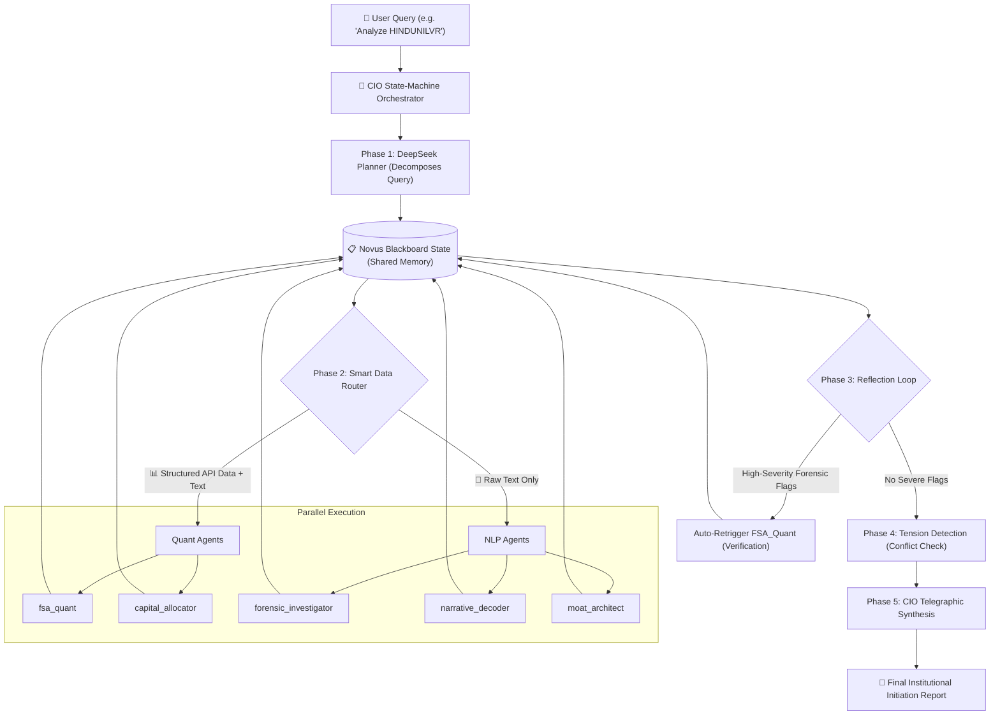

# Novus MAS: Multi-Agent FinLLM Workflow & Architecture

The Novus platform utilizes a highly orchestrated Multi-Agent System (MAS) designed to automate institutional-grade fundamental equity research. The system is governed by a **State-Machine Orchestrator** (`cio_orchestrator.py`) which manages context sharing, dynamic task delegation, parallel execution, and strict cross-agent verification.

## 📊 Architecture Diagram

---

## 🏗️ 1. The Blackboard Architecture
All agents share a single Pydantic state object (`NovusState`). This ensures that there is no fragmented memory—every agent reads from and writes to the same central source of truth.
* No hardcoded `if/else` execution paths.
* State is safely mutated via parallel threads.

---

## ⚙️ 2. The 5-Phase Orchestration Pipeline

When a user submits a ticker for analysis (e.g., "Analyze HINDUNILVR FY24"), the CIO Orchestrator executes the following 5 chronological phases:

### Phase 1: Strategic Audit Plan (Planning)
The orchestrator calls the "Lead Planner" AI (DeepSeek R1). 
* The Planner analyzes the user's specific query.
* It decomposes the query into a **Strategic Audit Plan** consisting of 3 to 5 discrete tasks.
* Each task is dynamically routed and assigned to a specific specialist agent from the `AgentRegistry`.

### Phase 2: Parallel Execution & Smart Data Routing
The orchestrator dispatches the planned tasks to the assigned agents **in parallel** to reduce total execution time to ~90 seconds. 

**Smart Data Routing mechanism:**
* **📊 Quant Agents** (`fsa_quant`, `capital_allocator`): Receive cleanly formatted, structured financial API data (e.g., from Screener.in) alongside the raw text. This prevents them from hallucinating numbers or struggling to extract math from unstructured PDFs.
* **📄 NLP Agents** (`forensic_investigator`, `narrative_decoder`, `moat_architect`): Receive **only** the raw unstructured text (synthesized from the RAG pipeline or PDF extraction) to focus on tone, governance, and qualitative phrasing.

*If an agent fails 3 times, a **Circuit Breaker** trips, preventing infinite loops and marking the task as `[FAILED: REQUIRES_HUMAN_AUDIT]`.*

### Phase 3: The Reflection Loop
Novus is built on institutional skepticism. After all parallel agents finish, the Orchestrator checks the output of the `forensic_investigator` agent. 
* If the forensic agent flagged any **HIGH severity** anomalies (e.g., "Spike in Related Party Transactions"), the Orchestrator **auto-retriggers** the `fsa_quant` agent.
* The `fsa_quant` agent is forced to run a dedicated mathematical verification of the specific forensic claims before proceeding.

### Phase 4: Conflict Check (Tension Detection)
The Orchestrator runs a cross-referencing loop across all completed agent findings to detect internal contradictions.
* *Example:* If the `narrative_decoder` claims management guided for 15% revenue growth, but `fsa_quant` notes historic math caps out at 6%, the orchestrator flags a **Discrepancy Entry** (Tension Alert) for the Final Report.

### Phase 5: Telegraphic Synthesis
The Orchestrator takes the collective findings of all specialized sub-agents, the Discrepancy Alerts, and the Confidence Scores, and prompts the **CIO Synthesis Agent**.
* The CIO Agent compiles everything into a strict, aggressive, and highly-formatted **Institutional Initiation Report**.
* It enforces a rule: If any agent's structural data had a confidence score `< 0.60`, it forces a `[DATA WARNING]` tag into the final text.
* It outputs final *Pre-Call Ammunition* (hard questions for management based on the forensic flags).

---

## 🤖 3. The Specialist Agent Roster
The `AgentRegistry` dynamically loads these 5 primary actors:

1. **`fsa_quant` (Financial Statement Analysis)**: The pure math agent. Reconstructs P&L, checks Cash Conversion Cycles, and verifies CFO vs EBITDA divergence.
2. **`forensic_investigator`**: The auditor. Hunts for aggressive accounting, capital work in progress (CWIP) bloat, subsidiary issues, and related party transactions.
3. **`narrative_decoder`**: The linguist. Analyzes Q&A and Management Discussion & Analysis (MD&A) to detect shifts in tone, omitted metrics, and hidden headwinds.
4. **`moat_architect`**: The strategist. Defines pricing power, barriers to entry, and structural industry advantages.
5. **`capital_allocator`**: The capital strategist. Assesses Return on Invested Capital (ROIC) trends, dividend sustainability, and M&A discipline.
